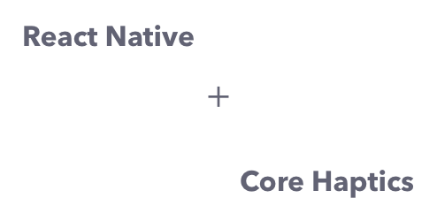

# react-native-core-haptics-api

✋ React Native → iOS Core Haptics

## About

react-native-core-haptics-api is a lightweight iOS-only module designed to expose the following Core Haptics methods to React Native:

- `-capabilitiesForHardware`
- `-stop`
- `-makePlayer`
- `-start`

This requires surfacing the following classes:

- `HapticDeviceCapabilty`
- `HapticEventParameterID`
- `HapticEventParameter`
- `HapticEventEventType`
- `HapticEvent`
- `HapticPattern`
- `HapticPatternPlayer`
- `HapticEngine`

These features are made available using syntax and patterns that resemble the native Swift implementation as closely as possible.

No other functionality is planned for this library, although feature parity with iOS Core Haptics is technically possible.

Read more about [Core Haptics on the Apple Developer site](https://developer.apple.com/documentation/corehaptics).

## Install

```sh
yarn install SnowcodeDesign/react-native-core-haptics-api
```

or

```sh
npm install SnowcodeDesign/react-native-core-haptics-api
```

## Usage

```js
// import the needed classes at the top of the file
import { HapticEngine, HapticEventParameterID, HapticEventParameter, HapticEventEventType, HapticEvent, HapticEvent, HapticPattern } from 'SnowcodeDesign/react-native-core-haptics-api';

// when setting up your component...
await HapticEngine.create();

// later down, in the implementation...
const startTime = 0;
const events = [{
    eventParameters: [{
        id: "HapticIntensity",
        value: 1,
    }, {
        id: "HapticSharpness",
        value: 0.6
    }],
    eventType: "HapticContinuous",
    duration: 0.5,
    relativeTime: 0
}];

// then, when you're ready to play...
await HapticEngine.capabilitiesForHardware();
if (!HapticEngine.getCapabilities().supportsHaptics) {
    return;
}

const shouldStop = false;
if (shouldStop) {
    await HapticEngine.stop();
    return;
}

// to chain together patterns and haptic events...
let patterns = [];
for (let event in events) {
    const parameters = event.eventParameters.map(parameter => {
        const parameterID = HapticEventParameterID.create(parameter.id);
        const value = parameter.value;
        const eventParameter = HapticEventParameter.create(
            parameterID, 
            value
        );
        return eventParameter;
    });

    const eventType = HapticEventEventType.create(event.eventType);
    const relativeTime = event.relativeTime;
    const duration = event.duration;

    const hapticEvent = HapticEvent.create(
        eventType, 
        parameters, 
        relativeTime, 
        duration
    );

    const hapticEvents = [hapticEvent];

     try {
        const pattern = HapticPattern.create(
            hapticEvents
        );
    } catch (e) {
        continue;
    }

    if (!pattern) {
        continue;
    }

    patterns.push(pattern);
}

// now, time to play all the constructed patterns...
for (let pattern of patterns) {
    await engine.makePlayer(pattern); // no need to store a ref, handled by engine internally
    await engine.start();
    await engine.getPlayer().start(startTime);
}
```

## Authors

```
Julian Weiss
snowcode.design
(c) 2021 Gamebytes
```

## License

```
MIT License

Copyright (c) 2021 Gamebytes

Permission is hereby granted, free of charge, to any person obtaining a copy
of this software and associated documentation files (the "Software"), to deal
in the Software without restriction, including without limitation the rights
to use, copy, modify, merge, publish, distribute, sublicense, and/or sell
copies of the Software, and to permit persons to whom the Software is
furnished to do so, subject to the following conditions:

The above copyright notice and this permission notice shall be included in all
copies or substantial portions of the Software.

THE SOFTWARE IS PROVIDED "AS IS", WITHOUT WARRANTY OF ANY KIND, EXPRESS OR
IMPLIED, INCLUDING BUT NOT LIMITED TO THE WARRANTIES OF MERCHANTABILITY,
FITNESS FOR A PARTICULAR PURPOSE AND NONINFRINGEMENT. IN NO EVENT SHALL THE
AUTHORS OR COPYRIGHT HOLDERS BE LIABLE FOR ANY CLAIM, DAMAGES OR OTHER
LIABILITY, WHETHER IN AN ACTION OF CONTRACT, TORT OR OTHERWISE, ARISING FROM,
OUT OF OR IN CONNECTION WITH THE SOFTWARE OR THE USE OR OTHER DEALINGS IN THE
SOFTWARE.
```
